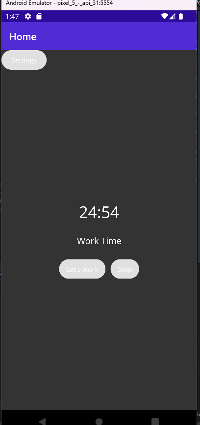

# Pomodoro Timer

A simple and efficient Pomodoro Timer built with .NET MAUI.



## About

The Pomodoro Technique is a time management method developed by Francesco Cirillo in the late 1980s. The technique uses a timer to break down work into intervals, traditionally 25 minutes in length, separated by short breaks. This application simplifies the process of using the Pomodoro Technique.

## Features

- Work and Break timers.
- Customizable work and break durations.
- Simple and clean user interface.

## Getting Started

### Prerequisites

- [.NET 6](https://dotnet.microsoft.com/download/dotnet/6.0)
- [MAUI](https://github.com/dotnet/maui)

### Installation

Clone the repo
```bash
git clone https://github.com/dkdkv/pomodoro.git
```
Navigate into the project directory
```bash
cd Pomodoro
```
Restore the project
```bash
dotnet restore
```
Build the project
```bash
dotnet build
```
Run the project
```bash
dotnet run
```
## Usage
Once started, the application will display a work timer. Press the "Start" button to start the work timer. When the work timer finishes, it will automatically switch to the break timer. Press "Stop" to stop the timer and reset back to the work timer.
